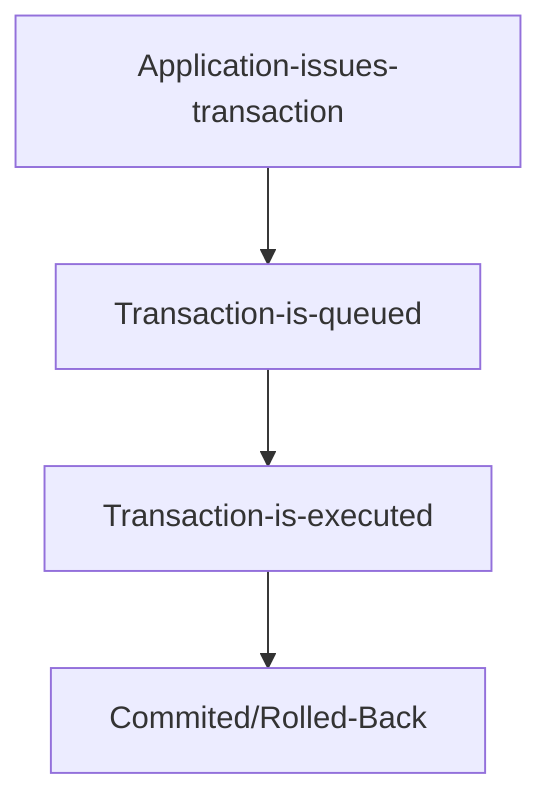

> Hard real-time does not mean real fast. It just means there is a tight upper bound to the time a process can take. 
Hard real time softwares fail if the timing deadline is not met.

### Mission Critical Software
Mission critical software is a software whose failure might cause catastrophic consequences.

**There are systems who fall in either or both category.**

### Deadline Management
The key tenet for hard realtime systems is deadline management. Complete means meeting the deadline successfully by commmiting or successfully aborting before the deadline.

### Metric
$$ Performance={ no of transactions that met deadline \over no of transactions that miss their deadline} $$

**Speed is not a metric to rate real-time systems** 

### Database Example as a hard real time system.
A single transaction potentially can have a lot of operations. If the deadline is not met all the operations inside the transactions should be rolled back. 



If the dedaline isn't met, the transaction will be rolled-back, typically the time taken for the rollback would be less than the time it would take for the whole set of operations to complete. Therefore if the total time for the transaction is T,t1= hard limit for queuing,t2= time to rollback.
```
t1= hard time limit for queuing.
t2= time taken for rollback.
t3= time taken for commit.
```
$$ T=t1+t2+t3 $$

If t1 is negligible
$$ T=t1+t2 $$
Therefore,
t2 should be typically less than T/2.

### Scheduling
#### EDF
Transactions are scheduled according to their priority and within the same priority, according to the `Earliest Deadline First` scheduling algorithm.
#### PI
The execution order is first-in-first-out (FIFO) without respect to deadlines within the same priority bucket tasks according to the `Priority Inheritance` scheduling algorithm.